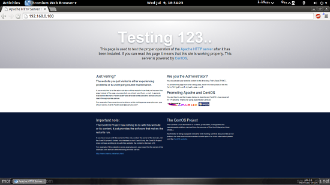
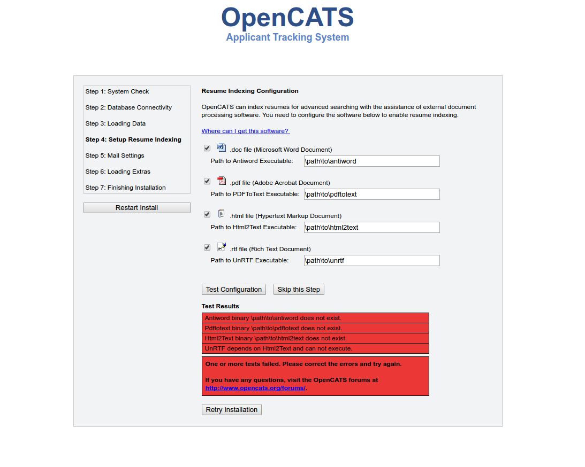

Install on Debian 8 Jessie
==========================

These instructions will walk you through setting up LAMP (Linux Apache Mysql PHP) software and install OpenCATS on a Debian 8 machine.  These instructions will work with a VPS, or a home/office machine.

.. note:: If this is a production machine, that is accessible by people outside your network, this walk-through doesn't address additional server security.  You would definitely want to make sure things are secured correctly.

.. warning:: If you are running a different version of Debian (other than 8) the default software versions will be different, which means the install process **will be different**.  

Debian 8-Installing MySQL/Mariadb
----------------------------------------------

.. note:: mysql and mariadb are basically the same software with different names.  You can use either, just change the commands to the appropriate name.

* ``$ sudo apt-get update``
* ``$ sudo apt-get install mariadb-server mariadb-client``
* Enter in the MariaDB/MYSQL root password you want to use.  I am using mariadbpassword in this walkthrough
* ``$ sudo mysql_secure_installation``

Securing-MySQL/MariaDB
----------------------

* Set root password? [Y/n] n
* New password: <--yourmariadbpassword  (Remember this or write it down!)
* Re-enter new password: <--yourmariadbpassword (Remember this or write it down!)
* Password updated successfully!
* Reloading privilege tables..... Success!
* Remove anonymous users? [Y/n] Y
* Disallow root login remotely? [Y/n] Y
* Remove test database and access to it? [Y/n] Y
* Reload privilege tables now? [Y/n] Y
* All done!  If you've completed all of the above steps, your MariaDB,installation should now be secure.  Thanks for using MariaDB!

Debian 8-Installing Apache2
------------------------------

* ``$ sudo apt-get install apache2``

Check for success-Apache
------------------------

.. note:: In this tutorial, we use localhost, if you're running a vps, you may need to enter the correct IP Address. These settings might differ for you, so you have to replace them where appropriate.

* Now direct your browser to localhost and you should see the Apache2 placeholder page:

Debian 8-Installing PHP5.6
-----------------------------

* ``$ sudo apt-get install php5 php-soap php5-ldap php5-mysql php5-gd php5-curl``
* ``$ sudo service apache2 restart``

.. note:: If you are typing these commands, the soap extension does not have a "5" on php.  It's easy to overlook.

Testing PHP5.6 / Getting Details About Your PHP5 Installation
-------------------------------------------------------------

.. note:: The document root of the default website is /var/www/html. We will now create a small PHP file (info.php) in that directory and call it in a browser. The file will display lots of useful details about our PHP installation, such as the installed PHP version.

* ``$ sudo nano /var/www/html/info.php``
* Type or paste the following into it and save as info.php:

.. literalinclude:: ../docs/_static/info.php
    :linenos:
    :language: php
    :lines: 1-5

* Ctl-O then enter to save the file
* Ctl-X to exit nano
* ``$ sudo service apache2 restart``
* In your browser, go to localhost/info.php

.. image:: ../docs/_static/infophp.png

If you see this screen, everything is good.  Scroll down and check to make sure all the extensions are there, then proceed. 

.. note:: If you get any PHP errors during the OpenCATS install, this screen can help you see what php modules are installed and loaded.

Setting up your MySQL/MariaDB database
--------------------------------------

.. note:: This is the backend database that stores all your OpenCATS information.  You likely will NOT be messing with this much after installation unless you choose to.  The login/password you set up here will NOT be the same as your login/password for OpenCATS.

.. note:: Make sure you remember or write down your login/password.  You'll need it in a few minutes.

* ``$ mysql -u root -p`` 

Then it will ask you for your mariadb/mysql root password

* You should see a prompt like this: ``mysql>``
* ``mysql>`` CREATE USER 'opencats'@'localhost' IDENTIFIED BY 'databasepassword';
.. note:: the "databasepassword" is not the same as the mariadb/mysql root password, and it won't be the same as your OpenCATS password.  All three of these are separate things.  You can use whatever passwords you want.  Just write them down and differentiate which is which.

* ``mysql>`` CREATE DATABASE opencats;
* ``mysql>`` GRANT ALL PRIVILEGES ON `opencats`.* TO 'opencats'@'localhost' IDENTIFIED BY 'databasepassword';
* ``mysql>`` exit;

.. note:: Make sure you don't forget the ; on the end of every line!

Download the OpenCATS files
---------------------------

* ``cd /var/www/html``
* ``$ sudo wget https://github.com/opencats/OpenCATS/archive/0.9.3-3.tar.gz``
* ``$ sudo tar -xvzf 0.9.3-3.tar.gz``
* ``$ cd OpenCATS-0.9.3-3``
* ``$ ls``  Now we should see all of the OpenCATS files in the OpenCATS directory

.. note:: By default, this directory is named OpenCATS0.9.3-3.  You can name it whatever you want.  Just remember that all of the directory locations from here on must match the name of the directory you create, including capitol letters.

.. note:: If you have tried installing OpenCATS before, or for any reason see something called INSTALL_BLOCK in this directory, you MUST delete it.  This will prevent OpenCATS from installing.  The command for that would be ``$ sudo rm INSTALL_BLOCK``.

Composer
--------
* ``$ sudo apt-get install curl``
* ``$ cd /usr/src``
* ``$ curl -sS https://getcomposer.org/installer | sudo php -- --install-dir=/usr/local/bin --filename=composer``
* ``$ sudo composer install``

If everything has gone correctly up to this point, composer will install a few things and get to the end with no errors.

Server and Directory permissions
--------------------------------

* ``$ cd ..`` to go up one directory into the main html folder
* ``$ sudo chown www-data:www-data OpenCATS-0.9.3-3``

.. warning:: make sure this is set to **EXACTLY** the name of your OpenCATS directory, default for version 0.9.3-3 would be ``OpenCATS-0.9.3-3``

* ``$ sudo chown -R www-data:www-data OpenCATS-0.9.3-3``
* ``$ sudo chmod 770 OpenCATS-0.9.3-3/attachments``
* ``$ sudo chmod 770 OpenCATS-0.9.3-3/upload``

Install resume indexing tools
-----------------------------

.. note::All of these should (hopefully) be in your repositories, if not, you'll have to search out sources online

* ``$ sudo apt-get install antiword poppler-utils html2text unrtf``

Install the OpenCATS software
-----------------------------

In your browser, go to localhost/OpenCATS-0.9.3-3 (Or use the address of your server or VPS in place of "localhost").

.. note::  If you have already attempted to install OpenCATS and the installer doesn't load, check to see if there is a file called 'INSTALL_BLOCK' in the OpenCATS directory. Delete it to allow the installer to run.

Click: ``Installation Wizard``

.. image:: ../docs/_static/installation-wizard.png

**Step 1: System Connectivity**

This step makes sure you have the required server environment set up correctly.  

.. note:: Green = good.  
.. note:: Yellow = OpenCATS will work, but some functions may not.  
.. warning:: Red = Bad  You can't continue the installation until a server environment issue is fixed.

If you see all green and/or yellow, click ``Next``

.. image:: ../docs/_static/step1.png

**Step 2: Database connectivity**

Enter your OpenCATS MySQL/MariaDB database name, MySQL/MariaDB database username, MySQL/MariaDB database password, and MySQL/MariaDB database host address in these boxes. 
 
.. note:: If you are running OpenCATS locally on your computer, or on some shared hosts, the host address will be localhost.  If your server, VPS (some shared hosting too), you will need to enter the specific address to access.

Click ``Test Database Connectivity``

.. note:: I usually get red the first few tries after click the ``test database connectivity`` button.  If you try more than a couple times and it stays red, you have either entered your MySQL/Mariadb information incorrectly, or you have set your MySQL/MariaDB database up incorrectly.  It needs to be corrected before proceeding.

.. image:: ../docs/_static/step2.png

**Step 3: Loading Data**

For a new installation, select ``New Installation``, then ``next``

.. note:: ``Demonstration Installation`` will autopopulate OpenCATS with general example clients, candidates, job orders, etc.  There's no reason to use this in my opinion.

.. note:: ``Restore installation from backup`` will be covered in a future tutorial

.. image:: ../docs/_static/step3.png

**Step 4 Setup resume indexing**

* Change the paths to the executables to the correct paths.  They should be as follows:
* /usr/bin/antiword 
* /usr/bin/pdftotext
* /usr/bin/html2text
* /usr/bin/unrtf
* Click ``Test Configuration``

.. note:: Like earlier, I always get red the first couple clicks, then it will go green.  If you get green, proceed.  If it stays red after a few click, the system isn't recognizing the executables.  There may be a path issue that needs corrected.

**Step 5 Mail Settings**

OpenCATS can send emails.  If you don't want to use it, you don't have to.  OpenCATS works great either way!  

Choose an option from the Mail Support drop-down bar, fill the necessary information in (if you are using it) and click ``Next``

.. image:: ../docs/_static/step5.png

**Step 6 Loading extras**

Don't forget to set the time zone to your area!

.. warning:: If you forget to set the time zone ALL of the timestamps on every note in OpenCATS will be wrong.   Set the time zone correctly.  You will thank us...

Choose the date format you like best

(United States only) choose to install (if you want) zip code lookup

Click ``next``

.. image:: ../docs/_static/step6.png

**Step 7 Finishing installation**

Runs through the installation process.  You should see a box and some pretty bars moving.  It shouldn't take long.

.. note:: The default username and password are: admin/admin (all lowercase)

Click ``Start OpenCATS`` for your login screen.

.. image:: ../docs/_static/step7.png

**Success!!**

Your brand new OpenCATS applicant System!

.. image:: ../docs/_static/first-login.png

