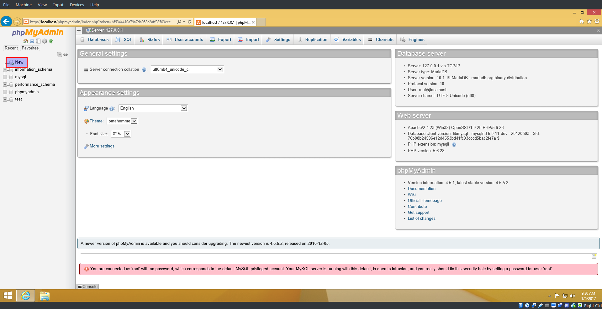
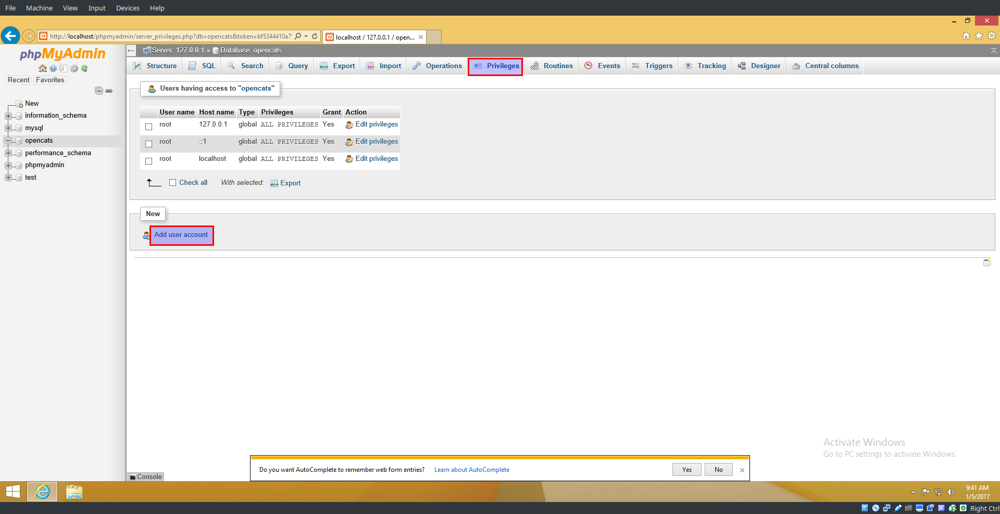
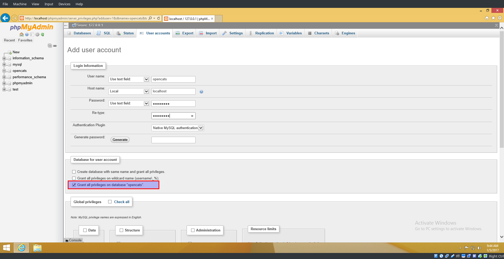
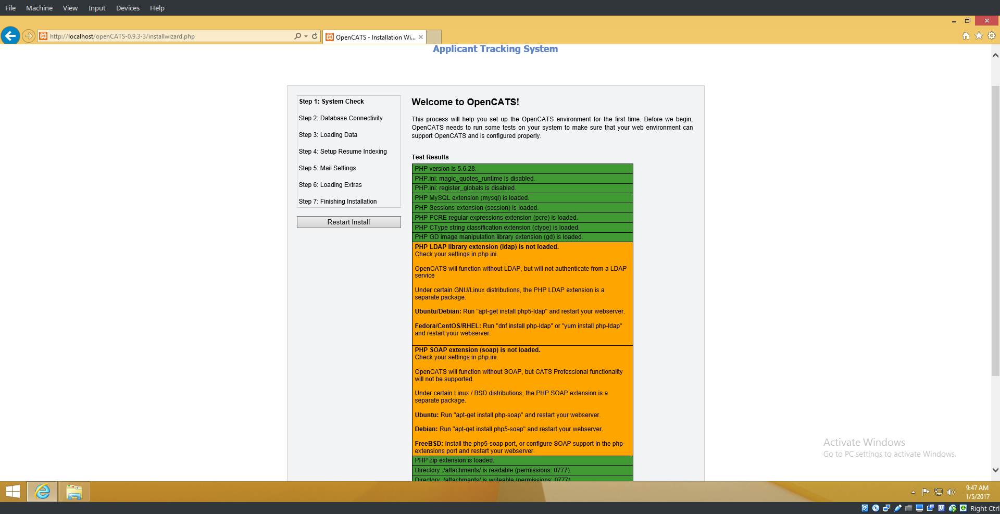

OS X - OpenCATS Installation Instructions
============================================

 
OS X Prerequisites
---------------------

Installation instructions are given for the MAMP default install environment only.
Requires OS X 10.10.5 or later.

Downloading software and preparing your system
----------------------------------------------
 
* Download - `MAMP <https://www.mamp.info/en/downloads/>`_
* Install - `MAMP <http://documentation.mamp.info/en/MAMP-Mac/Installation/>`_

.. warning:: You MUST finish installing MAMP before you install Composer.  

* Install Composer - `Composer <https://getcomposer.org/doc/00-intro.md#installation-linux-unix-osx>`_
* Download OpenCats - `OpenCATS_0.9.4 <https://github.com/opencats/OpenCATS/archive/0.9.4.zip>`_ .

* Extract downloaded file OpenCATS-0.9.4.zip into location where shall be installed

Composer-Install dependencies
-----------------------------

* Open Terminal
* switch to location with extracted OpenCATS
* Type ``composer install``
* After Composer is done installing the dependencies, close the terminal.

.. image:: ../docs/_static/mamp-quickstart.png

Configure and start MAMP
-----------

Start MAMP (`Frist steps <http://documentation.mamp.info/en/MAMP-Mac/First-Steps/>`)

.. image:: ../docs/_static/start-mamp.png

* on your MAMP click on ``Preferences...``
* Configure MAMP based on 'instractions <http://documentation.mamp.info/en/MAMP-Mac/Preferences/>`
* Configure Web Server
 * Go to Web Server tab
 * Select Apache or Nginx (what is preferred)
 * Select Document root  - choose location where is openCATS extracted
* Setup PHP version
 * Got to php tab
 * select php version 5.6.X

.. note:: if php 5.6.X is not in the options (free version supports only 2 php versions), it is necessary to define 'latest' versions.

Setup available PHP versions:

* Open terminal
* go to ``/Applications/MAMP/bin/php/`` directory
* list php versions ``ls`` 
* only last 2 php versions listed with above command are displayed in the MAMP
* it is necessary to rename unwanted versions to move them to the begining of the list.
  if there are for example php7.1.1 and php7.0.15, then rename for example ``php7.0.15`` to ``aphp7.0.15`` (``mv php7.0.15 aphp7.0.15``)
* close and start MAMP, you shoud see in preferences php versions as defined.

Create database
-----------------

* on your MAMP click on ``Open WebStart Page``
* it opens browser with MAMP dashboard

.. image:: ../docs/_static/ToDo.png

* From Tools select phpMyAdmin
* It opens phpMyAdmin in browser
* On the left side, click ``new`` to create a new database

* In the box labeled ``database name`` type ``opencats``.
* Hit ``create``

.. image:: ../docs/_static/phpmyadmin-newdb.png

You should now see "opencats" listed among the databases on the left.

* Click the opencats database
* In the top row of tabs, on the right side of the screen, click ``privileges``
* Click ``add user account``

* User name, make sure ``use text field`` is selected, in the empty box next to it type ``opencats``
* Host name: In the first box, select ``local`` from the drop-down options.  The second box should say ``localhost``
* Type opencats for the database password twice
* In the "database for user account section", confirm that the third checkbox ``Grant all privileges on database "opencats"`` is checked.
* Scroll down to the bottom and click ``go``

Set up OpenCATS
---------------

* on your MAMP click on ``Open WebStart Page``
* it opens browser with MAMP dashboard

.. image:: ../docs/_static/ToDo.png

* From manu choose ``My Website``
* it opens opencats start page in browser

If OpenCATS has been configured correctly, you should see a page that looks like this: 

.. image:: ../docs/_static/installation-wizard.png

**Step 1 System Connectivity**
This step makes sure you have the required server environment set up correctly.  

.. note:: Disregard the yellow errors.  They are not necessary for this installation and you will not lose any OpenCATS functionality.

If you see all green and/or yellow, click ``Next``

.. warning:: Red = Bad  You can't continue the installation until a server environment issue is fixed.

**Step 2 Database connectivity**

Enter the following information:
Database Name: opencats
Database User: opencats
Database Password: opencats
Database Host: localhost

Click ``Test Database Connectivity``

If the SQL information is set up and entered correctly, you should have all green.  If you see red, something needs to be corrected or set up correctly.

.. image:: ../docs/_static/step2.png

**Step 3 Loading Data**

For a new installation, select ``New Installation``, then ``next``

.. note:: Demonstration Installation will auto-populate OpenCATS with general example clients, candidates, job orders, etc.  There's no reason to use this in my opinion.

.. note:: Restore installation from backup will be covered in a future tutorial

.. image:: ../docs/_static/step3.png

**Step 4 Setup resume indexing**

Unfortunately, for now, there is no resume indexing.  
* Click ``Skip this Step``.

**Step 5 Mail Settings**

OpenCATS can send emails.  If you don't want to use it, you don't have to.  OpenCATS works great either way!  

Choose an option from the Mail Support drop-down bar, fill the necessary information in (if you are using it) and click ``Next``

.. image:: ../docs/_static/step5.png

**Step 6 Loading extras**

Don't forget to set the time zone to your area!

.. warning:: If you forget to set the time zone ALL of the timestamps on every note in OpenCATS will be wrong.  Set the time zone correctly.  You will thank us...

Choose the date format you like best

(United States only) choose to install (if you want) zip code lookup

Click ``next``

.. image:: ../docs/_static/step6.png

**Step 7 Finishing installation**

Runs through the installation process.  You should see a box and some pretty bars moving.  It shouldn't take long.

.. note:: The default username and password are: admin/admin  or admin/cats (all lowercase) depending on your OpenCATS version

Click ``Start OpenCATS`` for your login screen.

.. image:: ../docs/_static/step7.png

**Success!!**

Your brand new OpenCATS applicant System!

.. image:: ../docs/_static/first-login.png

