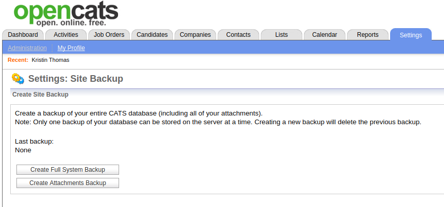
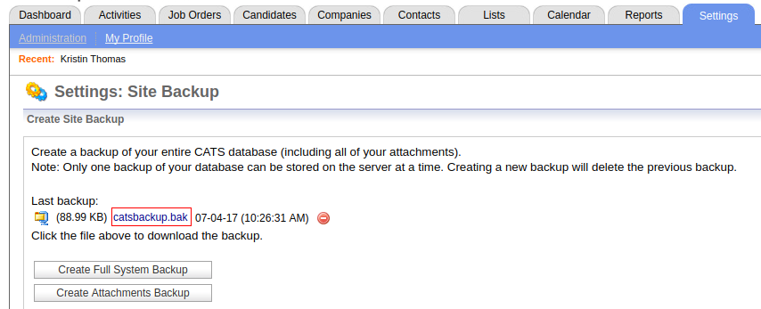
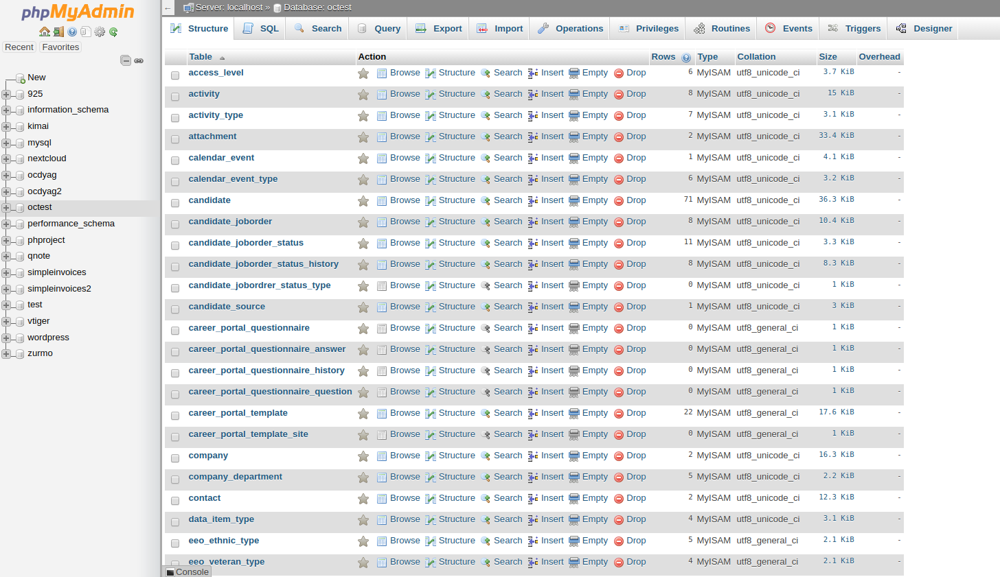

OpenCATS Backup/Restore and Upgrade Instructions-THIS SECTION INCOMPLETE!
=========================================================================

The backup/restore and Upgrade processes are the same.  

Backup/Restore best practices and things to consider
----------------------------------------------------
Any critical business software needs a backup and restore process in case of disaster.  There are a few different ways to backup and restore your OpenCATS Applicant Tracking system.  
A few things to consider when setting your backup strategy:
How often should you perform backups?
How often should you test your backups?
Where will you store your backups?
Will you automate your backup process?

This documentation will not cover these things, except the backup testing, but they should considered in case something ever happens to your OpenCATS system.

About this documentation/different environments
-----------------------------------------------

We will cover two different ways to backup and restore your OpenCATS system.

* **GUI:** Graphical User Interface (Point and click).  Built in to the OpenCATS system. 
* **Non-GUI:** A more typical, systems administrator approach to backup and restoring.

We will cover the different steps for:

* Windows environment
* Shared-hosting environments
* Linux/VPS environments

Pros and Cons: GUI vs. Non-GUI
------------------------------ 

* The GUI, **when it works**, is far easier for non-technical users.  
* As far as I know, the GUI backup works in OpenCATS versions 0.9.1, 0.9.1a, and 0.9.4.  I don't think it works in any of the other versions.  It is certainly worth a try if you want to.  
* Downloading the GUI generated backup file (catsbackup.bak) on certain shared hosting environments can also involve a few additional steps.  
* While the GUI backup restore process looks very simple, in my experience, the Non-GUI process is the simpler, and far more consistent way to go.

GUI (Graphical, point and click)
--------------------------------
OpenCATS has backup and restore functionality built in.  It works in versions 0.9.1, 0.9.1a, and 0.9.4.  I'm not sure about the versions in between.

.. image:: ../docs/_static/Backup-main-1.png

**GUI Backup:**

From the main screen:

* Click: ``Settings``
* Click: ``Administration``
* Click: ``Site Backup``

.. note:: ``Create Attachments backup`` will backup all the attachments in your OpenCATS system and allow you to export them for storage or redundancy.  This **WILL NOT** allow you to restore your OpenCATS database if you need to recover your OpenCATS system or upgrade in the future.  

Click: ``Create Full System Backup``
 
This will backup your entire OpenCATS ATS (attachments and database).  

Depending on the database size, this may take a few minutes.  Let it finish and you should return to this screen with a downloadable link for catsbackup.bak

.. image:: ../docs/_static/backup-complete.png

Click the link, the file will download to your local computer.  You can store it wherever you like if you need to recover your opencats system in the future.

**GUI Restore**

Go through the normal installation process for your environment. Do the following before you get to the final, GUI portion of the installation.

Create a directory called "restore" in the main OpenCATS directory.

.. note:: If you're using a VPS, or linux environment, make sure the directory permissions are writable.  Refer to the "directory or file permissions section" and match the permissions of the uploads and attachments folders.

Move the backup file that you want to restore into the newly created restore directory.

.. note:: When you create/save/store backup files, you can rename them however you want.  When you restore from a backup file, it MUST be named catsbackup.bak.  Make sure the name is correct before attempting the restore.  OpenCATS won't recognize any other file name/type.

Referring to the "Install the OpenCATS software" section of the installation walkthrough, on "Step 3: Loading Data", choose the ``Restore installation from backup`` option.

.. image:: ../docs/_static/step3.png

It will ask you to confirm that you have uploaded the catsbackup.bak file into the restore directory.  Check the box and click ``continue``.

.. image:: ../docs/_static/gui-restore-3.png

The rest of the installation should be normal.

This will put you into a newly restored OpenCATS system.

.. note:: As with any new OpenCATS installation, it will tell you the username and password is admin/admin.  It is NOT.  You will need the username and password from the prior OpenCATS installation that you restored.

Non-GUI
-------

The Non-GUI Backup/Restore steps are actually relatively simple.  Again, we need to backup the OpenCATS attachments and database, then restore them.  

* Attachments-This is where all our documents, CVS, resumes, etc are stored.
* Database-This is all the information that the OpenCATS system uses.

Environments:

* Shared hosting
* Command line
* Windows

**Backup storage organization and file structure.**

If you back up daily, you will need to consider some sort of way to organize your backup files.  The Non-GUI approach will produce two files per backup (catsdatabasename.sql and attachments.zip).
This is an example file/directory structure that I use.

**Directory:** OpenCATS Backup files

**Sub-Directory:** 7-1-17

* Attachments.zip
* opencats.sql

**Sub-Directory:** 7-2-17

* Attachments.zip
* opencats.sql

**Sub-Directory:** 7-3-17

* Attachments.zip
* opencats.sql

etc.

**Database Backup**

Windows/Shared-hosting:
Log in to phpmyadmin.  Refer to the installation instructions, under the php or phpadmin sections, to get there.

.. image:: ../docs/_static/phpmyadmin-backup1.png

In the column, on the left side, you should see a list of your MySQL/MariaDB databases.  Click on the name of your OpenCATS database.  You should then see the following screen:

Click the ``Export`` tab towards the top, center.  You should ten see the following screen:

.. image:: ../docs/_static/phpmyadmin-backup3.png 

Click ``Go``.  Phpmyadmin will generate the database backup file and you should automatically start downloading it.

The file will be named after your database name with an sql extension.  Mine, in this case, was named octest.sql.

Make sure you move your file to a safe place.

**Attachments backup**

**Restore non-gui**
In phpmyadmin:
Select newly created database from list on the left
Click import in the upper row
browse
select your opencatsdatabasebackup.sql file
Scroll to the bottom and click "go"

**Restore attachments**

Install opencats

Automating a windows backup
---------------------------

http://forums.opencats.org/viewtopic.php?f=2&t=810&start=10

Testing your backups/Setting up a test environment to reuse
-----------------------------------------------------------

Changing your user passwords in phpmyadmin
------------------------------------------

Try this

**Restore non-gui**
Create new database/user in phpmyadmin - Follow install documentation for this step if necessary

In phpmyadmin:
Select newly created database from list on the left
Click import in the upper row
browse
select your opencatsdatabasebackup.sql file
Scroll to the bottom and click "go"
Create user (follow steps from documentation)

Check for INSTALL_BLOCK file or folder in opencats directory
Install opencats

Use existing OpenCATS installation and automatically preform any necessary upgrade (recommended).

Merge/overwrite old attachments folder into new Opencats attachments directory

In phpmyadmin:
Create new database in phpmyadmin - Follow install documentation for this step if necessary
Select newly created database from list on the left
Click import in the upper row
browse
select your opencatsdatabasebackup.sql file
Scroll to the bottom and click "go"
Create user (follow steps from documentation) for the database and assign rights.

In NEW opencats directory
Check for INSTALL_BLOCK file or folder in opencats directory
Install opencats through browser

When you get to the intall type step (new, demo, restore, etc. ) You should see:
Use existing OpenCATS installation and automatically preform any necessary upgrade (recommended).
Select that option.

That should work. Post back with any questions/issues.

