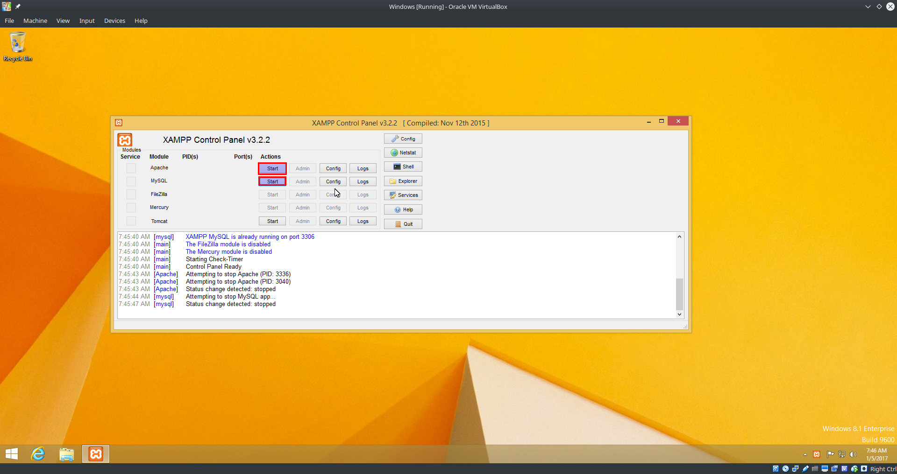
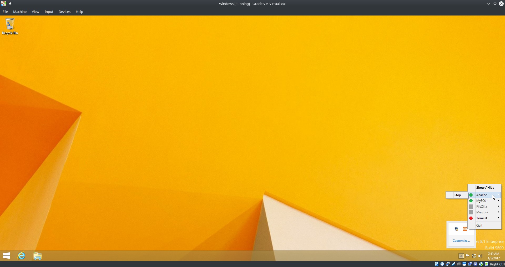

Windows - OpenCATS Installation Instructions
============================================

 
Windows Prerequisites
---------------------

Installation instructions are given for the XAMPP default install environment only.  WAMPP will also work if you prefer it.  The steps will be a little different.

Downloading software and preparing your system
----------------------------------------------
 
* Download - `XAMPP <https://www.apachefriends.org/xampp-files/5.6.28/xampp-win32-5.6.28-1-VC11-installer.exe>`_
* Install XAMPP
.. note:: You may get Windows defender warnings for Apache and MYSQL.  Just check the boxes that you want Windows to allow access to.  Private network would be for your home or office network only, public network would be for anything else.
.. image:: ../docs/_static/network-block.png

* Download - `OpenCATS-0.9.4-3 <https://github.com/opencats/OpenCATS/archive/0.9.4-3.zip>`_ .  You can not install this yet.
* Go to the folder where the OpenCATS-0.9.4-3.zip file is located (usually the Downloads folder)
* RIGHT-CLICK on the ``OpenCATS-0.9.4-3.zip`` file
* Click ``Extract All``
* Change the folder that the files will be extracted to, to the following: ``C:\xampp\htdocs\``
* Click ``extract``

Start Xampp
-----------

* Click the Windows start button and type ``xampp``
* Hit ``enter``. This will open the XAMPP control panel.

.. image:: ../docs/_static/start-xampp.png

* On the right side of Apache and MySQL, click ``start`` for each one.

.. note:: ONLY start the Apache and MySql services.  You do NOT need any of the other services.

* Stop the apache service (lower right corner, right click XAMPP, stop apache)
* Start the apache service

OPTIONAL - Renaming your OpenCATS directory
-------------------------------------------

The current default directory name for the OpenCATS files is OpenCATS-0.9.4-3. This will result in the web address in your browser being http://localhost/OpenCATS-0.9.4-3

If you want to rename the main OpenCATS directory to something else, you can. 

* Simply navigate to ``C:\xampp\htdocs``
* Right click on the OpenCATS directory
* Click ``rename``
* Rename the directory whatever you want (example: ATS)

Now, to access it, your browser address will be http://localhost/ATS

Launch phpMyAdmin
-----------------

* In your browser, go to:  http://localhost/phpmyadmin/

.. note:: If phpmyadmin does not load in this screen, stop and start your apache service again per the instructions above.

* On the left side, click ``new`` to create a new database

.. image:: ../docs/_static/phpmyadmin-main.png

* In the box labeled ``database name`` type ``opencats``.
* Hit ``create``

.. image:: ../docs/_static/phpmyadmin-newdb.png

You should now see "opencats" listed among the databases on the left.

* Click the opencats database
* In the top row of tabs, on the right side of the screen, click ``privileges``
* Click ``add user account``

.. image:: ../docs/_static/phpmyadmin-newuser.png

* User name, make sure ``use text field`` is selected, in the empty box next to it type ``opencats``
* Host name: In the first box, select ``local`` from the drop-down options.  The second box should say ``localhost``
* Type opencats for the database password twice
* In the "database for user account section", confirm that the third checkbox ``Grant all privileges on database "opencats"`` is checked.
* Scroll down to the bottom and click ``go``

.. image:: ../docs/_static/phpmyadmin-newuser2.png

Install and run Composer
------------------------

* Download and install- `Composer <https://getcomposer.org/Composer-Setup.exe>`_

On the settings Check screen, it should read: ``C:\xampp\php\php.exe``

.. image:: ../docs/_static/composer-wampp.png

* In the windows search menu, type ``cmd`` the open a command prompt.
* Type (Or copy/paste) ``cd C:\xampp\htdocs\opencats``
* Type ``composer install``

Composer will install some things.  

.. note:: If you get a composer install token error, just hit enter and it will continue without any issues.

Once composer is finished, close the command prompt and open your web broswer.

Set up OpenCATS
---------------

In your Web Browser, visit http://localhost/OpenCATS-0.9.4-3 (adjust if you renamed the OpenCATS directory).
If OpenCATS has been configured correctly, you should see a page that looks like this: 

.. image:: ../docs/_static/installation-wizard.png

**Step 1 System Connectivity**
This step makes sure you have the required server environment set up correctly.  

.. note:: Disregard the yellow errors.  They are not necessary for this installation and you will not lose any OpenCATS functionality.

If you see all green and/or yellow, click ``Next``

.. image:: ../docs/_static/win-install-wizard.png

.. warning:: Red = Bad  You can't continue the installation until a server environment issue is fixed.

**Step 2 Database connectivity**

Enter the following information:
Database Name: opencats
Database User: opencats
Database Password: opencats
Database Host: localhost

Click ``Test Database Connectivity``

If the SQL information is set up and entered correctly, you should have all green.  If you see red, something needs to be corrected or set up correctly.

.. image:: ../docs/_static/step2.png

**Step 3 Loading Data**

For a new installation, select ``New Installation``, then ``next``

.. note:: Demonstration Installation will auto-populate OpenCATS with general example clients, candidates, job orders, etc.  There's no reason to use this in my opinion.

.. note:: Restore installation from backup will be covered in a future tutorial

.. image:: ../docs/_static/step3.png

**Step.4-full Setup resume indexing**

Unfortunately, for now, there is no resume indexing.  
* Click ``Skip this Step``.

**Step 5 Mail Settings**

OpenCATS can send emails.  If you don't want to use it, you don't have to.  OpenCATS works great either way!  

Choose an option from the Mail Support drop-down bar, fill the necessary information in (if you are using it) and click ``Next``

.. image:: ../docs/_static/step5.png

**Step 6 Loading extras**

Don't forget to set the time zone to your area!

.. warning:: If you forget to set the time zone ALL of the timestamps on every note in OpenCATS will be wrong.  Set the time zone correctly.  You will thank us...

Choose the date format you like best

(United States only) choose to install (if you want) zip code lookup

Click ``next``

.. image:: ../docs/_static/step6.png

**Step 7 Finishing installation**

Runs through the installation process.  You should see a box and some pretty bars moving.  It shouldn't take long.

.. note:: The default username and password are: admin/admin  or admin/cats (all lowercase) depending on your OpenCATS version

Click ``Start OpenCATS`` for your login screen.

.. image:: ../docs/_static/step7.png

**Success!!**

Your brand new OpenCATS applicant System!

.. image:: ../docs/_static/first-login.png

