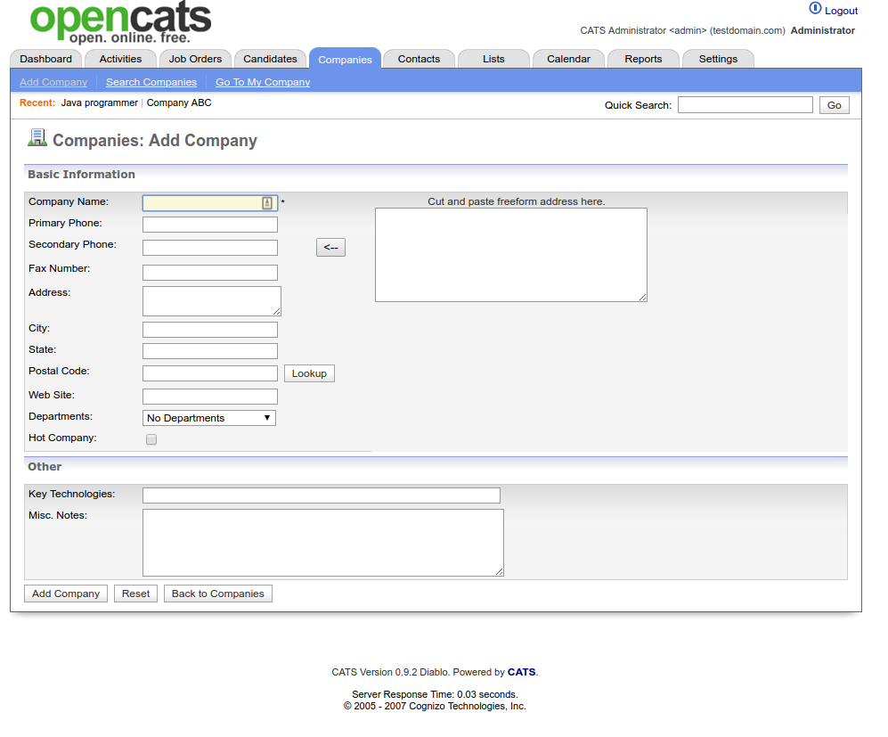
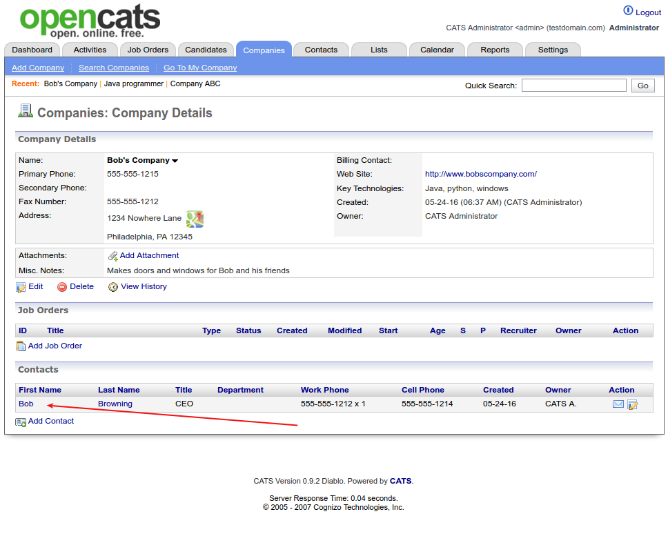
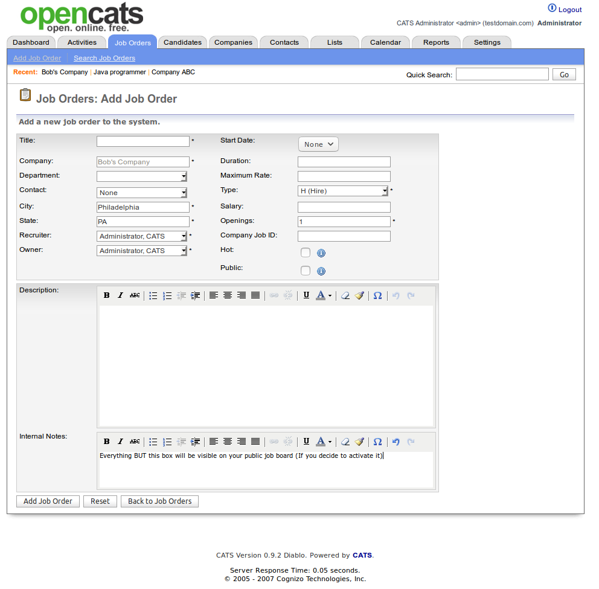
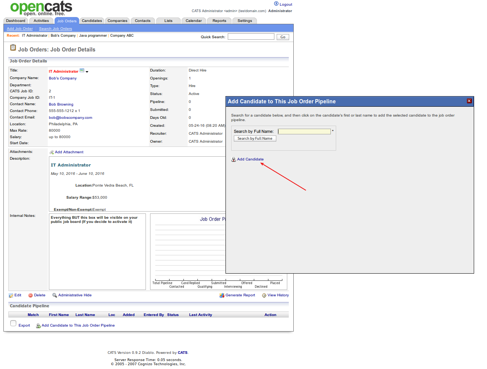

Using OpenCATS-The building blocks: companies, contacts, job orders, and candidates
===================================================================================

.. image:: ../docs/_static/uoc1.png

The modules
-----------

OpenCATS is made up of the following modules:

**Home** When you log into CATS, you will see the Home module. This is your dashboard, which
lists your activities. The Dashboard is customizable from the Settings module.

**Activities** All of your daily activities and interactions with candidates, companies and contacts are populated in this module.

**Job Orders**  All of the available Job Orders are displayed in this module. Search existing and create new Job Orders.

**Candidates** All of the available Candidates are displayed in this module. Search existing and create new Candidates. Access your Saved Lists.

**Companies** All of the available Companies are displayed in this module. Search existing and create new Companies.

**Contacts** All of the available Candidates are displayed in this module. Search existing and create new Contacts. Access your Cold Call List.

**Calendar** All scheduled events are populated in this module. By default, the Calendar shows the week view of the current week. Add new Events and access your Upcoming Events.

**Reports** All available reports are populated in this module.

**Settings** Options to customize your account and CATS features are available in this module. Users
change your Profile, Password. Administrators access your account, change your Career Portal and E- mail configurations, and customize your dashboard, import and backup data.

.. note:: Let's start entering in information and populating our fantastic new OpenCATS system.

Add a new Company
-----------------

Click on ``Companies``

.. note:: I have already entered some test information.  A new system screen will look a little different.

.. image:: ../docs/_static/uoc2.png

This is your main company screen.  This will have an overview of all the companies in your OpenCATS system.  From new leads, to active clients and old clients.  They will all be here.

.. note:: For internal hiring (your company), select ``Internal postings`` as the client.

Click on ``Add Company``

There are two ways to add information into OpenCATS.

* Copy and paste it into the box labelled ``cut and paste freeform address here``  Then clck the ``<--`` button to populate the fields. 
* Manually type and paste it into each field on the left.

.. note:: Don't forget to enter key technologies for the company and any miscellaneous notes that you want to save in the bottom two fields for future reference.

.. image:: ../docs/_static/uoc4.png

.. warning:: The success rate of auto-populating the information fields for me has always been terrible.  Sometimes it works great, sometimes it's doesn't.  I usually just enter the fields one at a time manually.

If it worked, it should look like this.  If some of the information did not populate, manually enter it and let's move one.

This is what you should see.

Click ``Add Company``

.. image:: ../docs/_static/uoc5.png

Voila!  You have a new client!

If you want to add any relevant attachment documents such as a copy of your client agreement, benefits overview, etc.  Click the ``Add Attachment`` button.

.. image:: ../docs/_static/uoc6.png

Add a new Contact
-----------------

Next let's add a Company Contact.

Click ``Add Contact`` at the bottom of the current screen.

.. image:: ../docs/_static/uoc6-1.png

Fill in all the information fields, including any relevant notes that's you want to remember for later.  Then click ``Add Contact``

You should now see the contact listed in the Contacts section of the Company screen.

Add a new Job Order
-------------------

From the current screen, let's add our first Job order.  Click ``Add Job Order`` in the Job Orders section of Bob's Company page.

.. note:: OpenCATS is set up to run Direct-hire (Perm) or Contract (project) jobs.  We will note the differences below.

Let's look at the fields in the **Add Job Order** screen:

.. image:: ../docs/_static/uoc8.png

The fields on the upper left column are self-explanatory.

* **Start Date** is when the hired candidate should start.
* **Duration** The length of contract (Project) for a temporary role.  It this is a permanent role, you can put "direct hire", whatever you want, or just leave it blank.
* **Maximum rate** Self-explanatory
* **Type** This drop-down field let's you select the type of role.  Options are: Hire, Contract to hire, Contract, or freelance
* **Salary** Put the salary range here
* **Openings** Number of openings
* **Company Job ID** This is for the unique Job ID assigned to this role.
* **Hot**  If this is a hot job, check this box.
* **Public** If you have the OpenCATS job board set up (we will do this later), checking this box will make this job order visible on it.  Candidates will be able to view and apply.
* **Description** Enter your job description here
* **Internal Notes** Any notes or information entered here will be visible within your company, but not visible on your public job board.

.. note::  If you have the public job board set up (we will go through this later), all the information on this screen **except** the **Internal Notes** section will be viewable to anyone looking at your jobs.  Including the listed salary information.  If you do not want that visible, put it in the **Internal Notes** section.

Click ``Add Job Order`` 

This will take you to your new Job Order screen.

.. image:: ../docs/_static/uoc10.png

If everything looks correct, let's move on to adding our frst candidate in OpenCATS and into the pipeline for this job.

Click ``Add Candidate to This Job Order Pipeline`` at the bottom of the screen.

.. image:: ../docs/_static/uoc11.png

Then ``Add Candidate``.  

